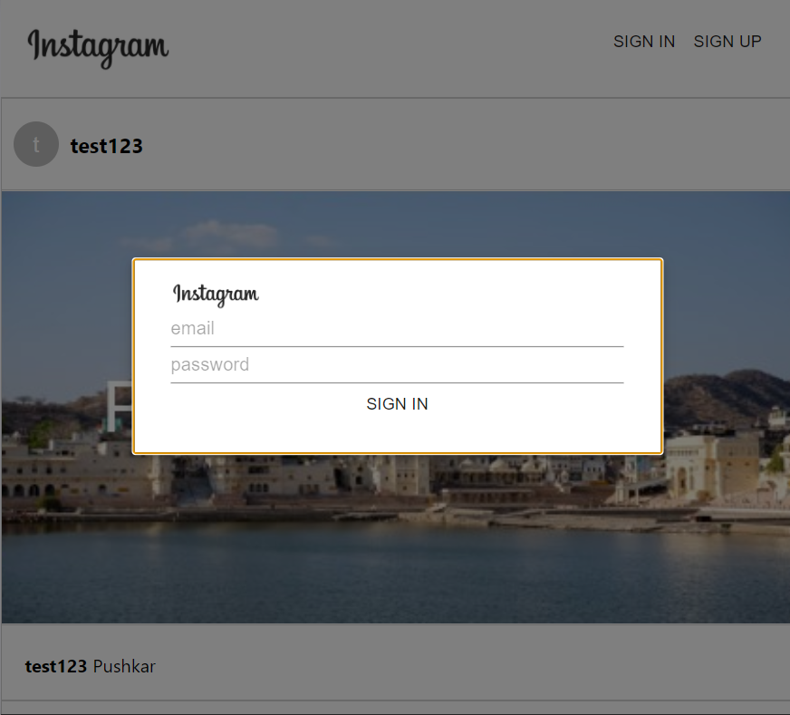

## Instagram Clone using React JS
<h4>This is an Instagram Clone where the user can <strong>Sign Up</strong> and <strong>Sign In</strong> and the database and user authentication is done using </h4> <h4><a href = 'https://firebase.google.com/'>Firebase</a></h4>

***

### Images

<br>

<br>
<br>   

***

### Install Node JS:-

<strong><a href = "https://nodejs.org/dist/v14.15.1/node-v14.15.1-x64.msi">Windows </a></strong>
<strong><a href = 'https://nodejs.org/dist/v14.15.1/node-v14.15.1.pkg'>Linux/MacOS</a></strong>

***

### Prerequisites:-
<li /> <a href = "https://nodejs.org/en/">nodejs v6.11.3 or later</a>
<li> <a href = "https://firebase.google.com/">Firebase </a></li>
<li> <a href = "https://material-ui.com/">Material UI</a></li>

***

### Installing:- 
<h4>Clone the Repository by copying the following commands on your terminal/bash.</h4>

 ```Javascript
    git clone https://github.com/vaibhavmantri/instagram-clone.git 
 ```

<h4>Or simply Download .zip file and run the following commands in your terminal/bash/shell</h4>

```
   npm install
```
<h4>This will install all the dependencies which are required for the above project to run in your system</h4>

***

<br>

### Building the Project

<strong>Install</strong>

```
yarn
```
or 
```
npm install
```

To Run this whole setup

```
yarn start
```
or 
```
npm start
```

<strong>Build</strong>

Build for current platform
```
yarn run build
```
Build for Windows
```
yarn run build_windows
```
Build for MacOS
```
yarn run build_mac
```
Build for Linux
```
yarn run build_linux
```

### Libraries Used

<li /><a href = "https://reactjs.org/docs/getting-started.html">React JS</a></li>
<li /><a href = "https://devdocs.io/html/">HTML 5</a></li>
<li /><a href = "https://developer.mozilla.org/en-US/docs/Web/CSS">CSS 3</a></li>
<li /><a href = "https://redux.js.org/">Redux</a></li>
<li /><a href = "https://firebase.google.com/docs/firestore">Firebase Firestore</a></li>
<li /><a href = "https://firebase.google.com/docs/hosting">Firebase Hosting</a></li>
<li /><a href = "https://firebase.google.com/docs/auth">Firebase Authentication</a></li>
<li /><a href = "https://material-ui.com/getting-started/installation/">Material UI(Icons/Modals)</a></li>
<li /><a href = "https://fonts.google.com/">Google Fonts</a></li>

=======
https://instagram-clone-fdd9f.web.app/
>>>>>>> 0a35badcf49d82e31c0f8a8c95898aa34b648a87
